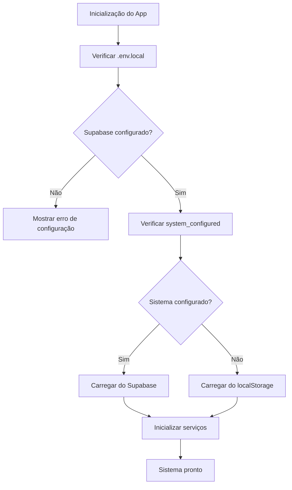

# Configuração Automática do Sistema

## Problema Identificado

O sistema está mostrando a tela de configuração inicial mesmo quando as credenciais já estão configuradas no Supabase e no arquivo `.env.local`.

## Solução Implementada

### 1. Carregamento Automático de Configurações

O sistema agora verifica automaticamente se já existe configuração no Supabase antes de solicitar nova configuração:

- **Primeiro**: Verifica se `system_configured = true` na tabela `system_settings`
- **Segundo**: Se configurado, carrega as configurações do Supabase
- **Terceiro**: Se não configurado, tenta carregar do localStorage como fallback

### 2. Dados de Exemplo Incluídos

O arquivo `database/sample-data.sql` já inclui:

```sql
-- Configuração OpenAI de exemplo
INSERT INTO public.ai_configurations (name, provider, model, api_key_encrypted, temperature, max_tokens, system_prompt, is_active) VALUES
('OpenAI GPT-3.5 Turbo', 'openai', 'gpt-3.5-turbo', 'sk-exemplo-chave-api-openai-aqui', 0.7, 1000, '...', true);

-- Configurações Evolution de exemplo
INSERT INTO public.system_settings (key, value, description) VALUES
('evolution_api_url', '"https://api.evolution.tiaen.com.br"', 'URL base da Evolution API'),
('evolution_api_key', '"sua-chave-api-evolution-aqui"', 'Chave de API da Evolution'),
('evolution_instance_name', '"tiaen-principal"', 'Nome da instância principal do WhatsApp'),
('system_configured', 'true', 'Indica se o sistema foi configurado inicialmente');
```

### 3. Como Configurar com Suas Credenciais Reais

#### Opção 1: Via Interface (Recomendado)
1. Acesse a página `/rag`
2. Vá na aba "Configuração"
3. Configure suas credenciais OpenAI e Evolution API
4. O sistema salvará automaticamente no Supabase

#### Opção 2: Diretamente no Supabase
1. Acesse seu painel do Supabase
2. Vá em "Table Editor"
3. Edite a tabela `ai_configurations`:
   ```sql
   UPDATE ai_configurations 
   SET api_key_encrypted = 'sua-chave-openai-real'
   WHERE provider = 'openai';
   ```
4. Edite a tabela `system_settings`:
   ```sql
   UPDATE system_settings 
   SET value = '"https://sua-evolution-api.com"'
   WHERE key = 'evolution_api_url';
   
   UPDATE system_settings 
   SET value = '"sua-chave-evolution-real"'
   WHERE key = 'evolution_api_key';
   
   UPDATE system_settings 
   SET value = '"seu-nome-instancia"'
   WHERE key = 'evolution_instance_name';
   ```

#### Opção 3: Via Arquivo .env.local
Crie o arquivo `.env.local` na raiz do projeto:
```env
# Configuração do Supabase (obrigatório)
NEXT_PUBLIC_SUPABASE_URL=https://seu-projeto.supabase.co
NEXT_PUBLIC_SUPABASE_ANON_KEY=sua-chave-anonima-aqui

# Configurações opcionais (podem ser definidas via UI)
OPENAI_API_KEY=sk-sua-chave-openai-aqui
EVOLUTION_API_URL=https://sua-evolution-api.com
EVOLUTION_API_KEY=sua-chave-evolution-aqui
EVOLUTION_INSTANCE_NAME=seu-nome-instancia
```

### 4. Verificar se Está Funcionando

#### Teste Rápido via Browser Console:
```javascript
// Abra o console do navegador (F12) e execute:
fetch('/api/test-config')
  .then(r => r.json())
  .then(console.log)
```

#### Teste via Script Node.js:
1. Edite o arquivo `test-config.js` com suas credenciais
2. Execute: `node test-config.js`

### 5. Logs de Debug

Para debugar problemas de carregamento, abra o console do navegador e verifique:

1. **Erros de Rede**: Problemas de conexão com Supabase
2. **Erros de Autenticação**: Chaves API inválidas
3. **Logs do Context**: Mensagens de debug do RAGContext

### 6. Estrutura de Dados

#### Tabela `ai_configurations`:
```sql
id | name | provider | model | api_key_encrypted | temperature | max_tokens | system_prompt | is_active
```

#### Tabela `system_settings`:
```sql
id | key | value | description | created_at | updated_at
```

### 7. Fluxo de Carregamento



## Troubleshooting

### Problema: Sistema não carrega configurações
**Solução**: Verifique se os dados foram inseridos corretamente no Supabase executando:
```sql
SELECT * FROM system_settings WHERE key = 'system_configured';
SELECT * FROM ai_configurations WHERE is_active = true;
```

### Problema: Erro de conexão com Supabase
**Solução**: Verifique se as variáveis `NEXT_PUBLIC_SUPABASE_URL` e `NEXT_PUBLIC_SUPABASE_ANON_KEY` estão corretas no `.env.local`.

### Problema: Configurações não são salvas
**Solução**: Verifique as permissões RLS (Row Level Security) no Supabase. As tabelas devem permitir inserção e leitura.

## Próximos Passos

1. ✅ Implementar carregamento automático de configurações
2. ✅ Adicionar dados de exemplo ao sample-data.sql
3. ✅ Criar interface para editar configurações existentes
4. 🔄 Testar com credenciais reais
5. 📝 Documentar processo de configuração

## Conclusão

Com essas mudanças, o sistema agora:
- Detecta automaticamente se já foi configurado
- Carrega configurações do Supabase quando disponíveis
- Permite edição de configurações existentes
- Mantém fallback para localStorage
- Fornece feedback claro sobre o status da configuração 